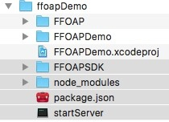
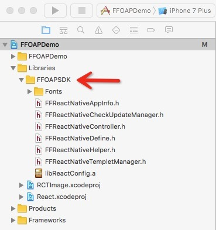
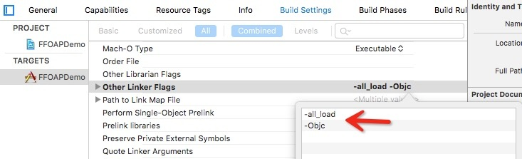
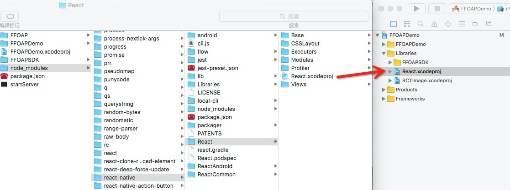
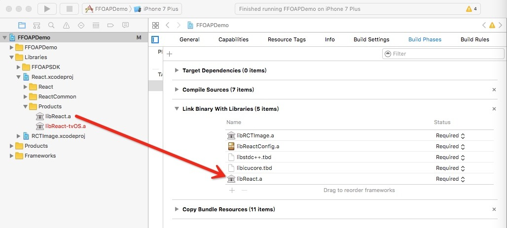
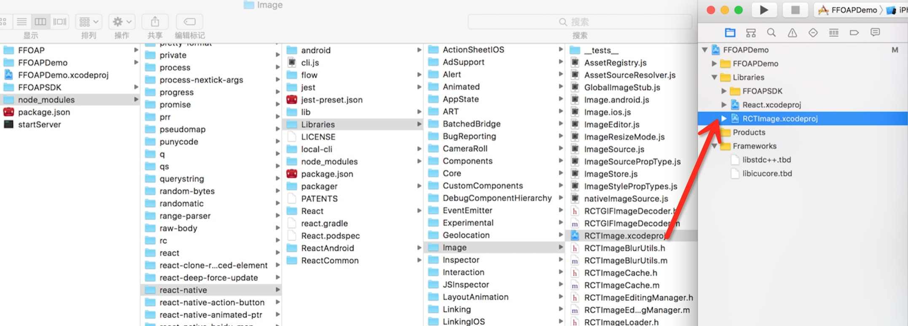
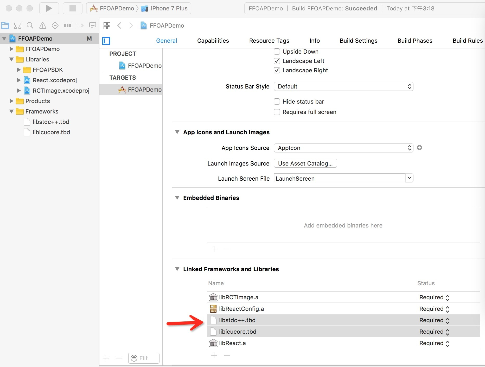

# 开发者文档
## 一、注册
1、首先您需要打开 [开发者平台首页](http://open.sit.ffan.net/apps/list)，点击右上角注册按钮，填写相关信息注册为开发者。

## 二、开发
### 1、创建应用
1、点击 [应用市场](http://open.sit.ffan.net/apps) -> 创建新应用，按要求填写相关应用信息，创建应用
2、成功创建应用后，系统会生成AppID和AppSecrect（待补充）

### 2、环境搭建
Android开发者：
1、首先，请下载安装IDE。[请点击下载AndroidStudio](https://developer.android.com/studio/index.html)
2、安装ReactNative运行环境。[参考官方文档](http://facebook.github.io/react-native/docs/getting-started.html)
```bash
# 1.安装brew
/usr/bin/ruby -e "$(curl -fsSL https://raw.githubusercontent.com/Homebrew/install/master/install)"
# 2.安装node
brew install node
# 3.安装watchman
brew install watchman
# 4.安装react-native
npm install -g react-native-cli
```

3、集成SDK（待补充）[点击下载SDK](http://open.sit.ffan.net/apps/create)
4、验证环境（待补充）

iOS开发者:
1、首先，请下载安装IDE。[请点击下载Xcode](https://itunes.apple.com/cn/app/xcode/id497799835?mt=12)

>注：Xcode最低版本要求为7.0

2、安装ReactNative运行环境。
homebrew—— Mac系统的包管理器，用于安装NodeJS和一些其他必需的工具软件。
```
/usr/bin/ruby -e "$(curl -fsSL https://raw.githubusercontent.com/Homebrew/install/master/install)"
```
node——使用homebrew来安装nodejs，node版本需要5以上的，正常安装即可。
```
brew install node
```
react native cli——使用npm安装react native命令行工具。
```
npm install -g react-native-cli
```
watchman——使用homebrew安装watchman，这是一个由Facebook提供的监视文件系统变更的工具。安装此工具可以提高开发时的性能（packager可以快速捕捉文件的变化从而实现实时刷新）。
```
brew install watchman
```
3、集成SDK：[点击下载SDK](http://open.sit.ffan.net/apps/create)
##### A.添加SDK文件
将FFOAPSDK目录，node_modules目录，package.json，startServer拷贝到工程同级目录



##### B.添加libReactConfig

将包含libReactConfig.a，一系列头文件和Fonts目录的文件夹FFOAPSDK拖拽到工程中



##### C.设置flag
找到对应target的Build Settings，Linking－>Other Linker Flags 添加flag，`-Objc`和`-all_load`




##### D.添加ReactNative库
添加React组件工程文件:
将node_modules/react-native/React/React.xcodeproj拖到工程中



##### E.配置库依赖
点击你的主工程文件，选择Build Phases，然后把刚才所添加进去的.xcodeproj下的Products文件夹中的静态库文件（.a文件），拖到Link Binary With Libraries组内。




##### F.添加其它组件依赖
其它本地组件都在node_modules/react-native/Libraries目录。使用同样的方法添加RCTImage或其他组件



##### G.添加系统依赖库
点击你的主工程文件，选择General，在Linked Frameworks and Libraries 添加`libstdc++.tbd`和`libicucore.tbd`



4、验证环境，请输入如下命令行：
```
    react-native init AwesomeProject
    cd AwesomeProject
    react-native run-ios
```
现在你已经成功运行了项目，我们可以开始尝试动手改一改了：
		A、使用你喜欢的编辑器打开index.ios.js并随便改上几行。
		B、在iOS 模拟器中按下⌘-R就可以刷新App并看到你的最新修改！


FE开发者:
1、首先，请下载安装IDE。[JS开发者请点击下载WebStorm](http://www.jetbrains.com/webstorm/)
2、安装ReactNative运行环境（待补充）
3、集成代码审查规则文件（待补充）[点击下载代码审查规则文件](http://www.jetbrains.com/webstorm/)
4、验证环境（待补充）

开发应用:
1、创建App（待补充）
2、创建配置文件（待补充）
3、编码
编码语言：JavaScript
语法规范：[ES6](http://www.es6js.com)
4、API文档（待补充）

## 三、调试
1、调试环境配置说明（待补充）
2、调试步骤

进入工程目录中的js_module目录，运行npm start或者react-native start，开启服务，初始化IReactConfig时候在下列方法中返回true, 并在LocalDebugParams中传入调试的moduleName。

## 四、打包
1、[请下载打包工具](http://open.sit.ffan.net/apps/list)
2、参考打包工具中的应用规范对包进行调整（待补充）
3、参考打包工具中的使用文档进行打包（待补充）

## 五、发布
1、[登陆开发者平台首页](http://open.sit.ffan.net)，点击 应用市场->我的应用->发布新版本，并上传应用文件，如：应用名.fap
2、填写版本号，版本号采用标准三段式，如：1.0.0
3、填写版本简介，字数请限制在120字内
4、提交审核（审核规则待补充）

## 六、审核
1、应用审核通过后，可以在 我的应用->已审核 中查看
2、点击发布，会上架到应用商店
